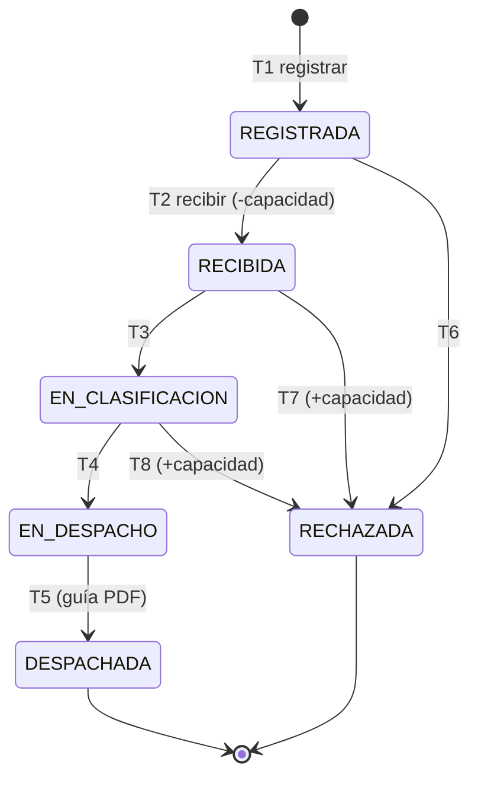

# Máquina de estados de la entrega

El corazón del caso. Todo lo demás (mensajería, notificaciones, KPIs,
auditoría) son consecuencias de las transiciones definidas aquí.

## Estados

| Código (en el código) | Etiqueta (en la UI) | Terminal |
|---|---|---|
| `REGISTRADA` | Registrada | no |
| `RECIBIDA` | Recibida | no |
| `EN_CLASIFICACION` | En clasificación | no |
| `EN_DESPACHO` | En despacho | no |
| `DESPACHADA` | Despachada | **sí** |
| `RECHAZADA` | Rechazada | **sí** |

> **Decisión de nombres.** El enunciado escribe `EN_CLASIFICACIÓN` con tilde.
> En el código va **sin tilde**: un enum de Java, una clave JSON y un nombre
> de tópico con `Ó` arrastran problemas de encoding entre Oracle, Kafka y el
> navegador que no aportan nada. La tilde vive sólo en la etiqueta que ve el
> usuario, en el frontend.

## Transiciones permitidas

| # | Desde | Hacia | Quién | Efectos |
|---|---|---|---|---|
| T1 | — | `REGISTRADA` | Productor, Jefe de acopio | Se crea la entrega |
| T2 | `REGISTRADA` | `RECIBIDA` | Jefe de acopio | **Descuenta capacidad de bodega**, email al productor, ticket a bodega |
| T3 | `RECIBIDA` | `EN_CLASIFICACION` | Jefe de acopio | Email al productor |
| T4 | `EN_CLASIFICACION` | `EN_DESPACHO` | Jefe de acopio | — |
| T5 | `EN_DESPACHO` | `DESPACHADA` | Jefe de acopio | Genera guía de despacho (PDF), email al productor |
| T6 | `REGISTRADA` | `RECHAZADA` | Jefe de acopio | Email al productor con el motivo |
| T7 | `RECIBIDA` | `RECHAZADA` | Jefe de acopio | **Devuelve la capacidad de bodega**, email con motivo |
| T8 | `EN_CLASIFICACION` | `RECHAZADA` | Jefe de acopio | **Devuelve la capacidad de bodega**, email con motivo |

**Cualquier otra transición se rechaza con `409 Conflict`.** En particular:

- No se puede llegar a `EN_DESPACHO` sin haber pasado por `RECIBIDA`
  (regla explícita del enunciado). La tabla ya lo garantiza: el único
  camino a `EN_DESPACHO` viene de `EN_CLASIFICACION`, y el único camino a
  `EN_CLASIFICACION` viene de `RECIBIDA`.
- Desde un estado terminal no sale ninguna transición.
- El Productor **no** cambia estados: sólo registra (T1) y consulta.
  El Auditor no escribe nada, nunca.

## Diagrama

## Supuestos que hay que confirmar con la pauta del martes

1. **¿La capacidad de bodega se libera al DESPACHAR?** El enunciado sólo
   dice que *disminuye al recibir*. Aquí se asumió que **no** se libera en
   `DESPACHADA` — el lote salió, pero el registro histórico de ocupación se
   mantiene — y que **sí** se devuelve en un rechazo posterior a la
   recepción (T7, T8), porque ahí el lote nunca debió ocupar bodega.
   Si la pauta dice otra cosa, se cambia en un solo lugar.
2. **¿Se puede rechazar una entrega ya en `EN_DESPACHO`?** Aquí se asumió
   que no: una vez que el camión está cargando, la salida es despachar.
3. **¿El Admin puede cambiar estados?** El enunciado dice que en la pantalla
   de entregas cambian estado "jefe de acopio/admin", pero en la tabla de
   alcance funcional sólo aparece el Jefe de acopio. Aquí se asumió que
   **el Admin puede hacer todo lo que hace el Jefe de acopio**.

## Dónde vive esta lógica

En `ms-agrotrack-deliveries`, en una clase de dominio pura, sin Spring,
sin JPA y sin acceso a red — una función que recibe (estado actual, estado
destino, rol) y devuelve si la transición es válida y qué efectos dispara.
Así se puede probar la máquina de estados completa con tests unitarios
rápidos, sin levantar Oracle ni Kafka.
